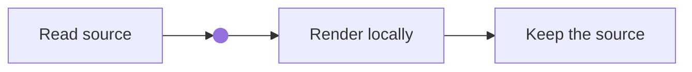
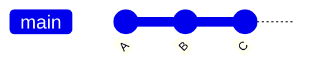
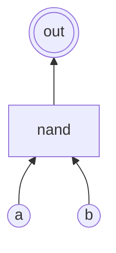
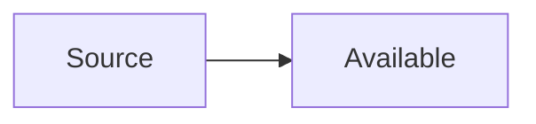

## Ordinary Mermaid fences

The source stays an ordinary `mermaid` fence. No front-matter flag is needed.
Rendering happens locally; the controls zoom and scroll an inert vector image.





## Original drawio files

The native file is the source of truth. This harmless example includes an HTML label
and a locally bundled polygon stencil. Download it to edit in your local app; no
online editor is opened and no diagram is sent to a hosted service.



## Fold, grid and explicit inversion

Native container notation is unchanged: outer `%`, nested `<`. Opening a hidden fold
allows its diagrams to render. A deliberate inversion wrapper uses a fixed light
renderer palette so automatic dark recoloring does not invert it twice.

{}










{}

## GitHub badges are external images

This public upstream repository is an example, not a Sidera dependency declaration.
The badges load directly from **Shields** as ordinary images, according to the
approved automatic-loading policy. Their provider may be unavailable or return stale
information. The repository link remains useful independently.



## Source-only states







## Conversion recipes

- Mermaid fences stay fences. Keep B's approved `block` conversion for explicit inversion.
- `` becomes the following, with the native file beside the page:

```text

```

- `` becomes:

```text

```

No original article prose or diagrams were copied into this specimen.
